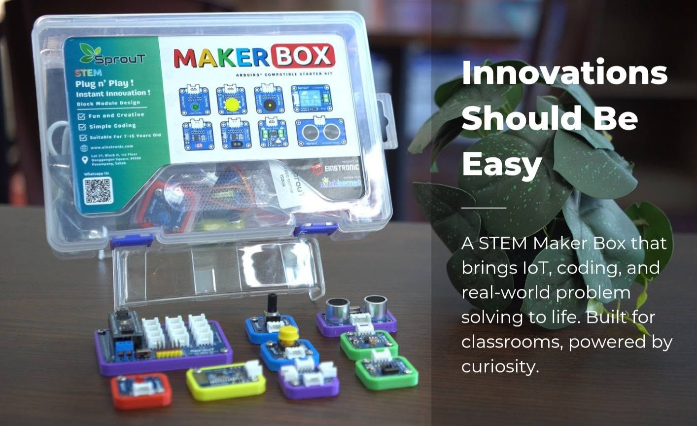

## About SprouT Maker Box

  

Welcome to the official SprouT Maker Box wiki! This section provides a comprehensive overview of the SprouT Maker Box, its purpose, target audience, and key specifications.

---

### 1.1 Overview
The **SprouT Maker Box** is an educational electronics and coding starter kit designed by Einstronic Enterprise. It aims to introduce children and beginners to the exciting worlds of Science, Technology, Engineering, and Mathematics (STEM) through hands-on making, physical computing, and programming.

By combining an Arduino-compatible microcontroller with various sensory and output modules, the SprouT Maker Box offers a highly interactive platform where users can transition from learning basic hardware logic to building complex, real-world automated prototypes.

---

### 1.2 Target Audience & Educational Value
* **Designed For:** Children and makers aged **7 to 15 years old**.
* **Skill Levels:** Beginner to Intermediate. No prior coding or electronics experience is required!
* **Scale of Learning:** Projects scale incrementally in difficulty. Beginners start with simple, intuitive physical concepts and gradually advance to visual block coding or text-based Arduino programming as their confidence and skills grow.
* **In the Classroom:** It serves as an excellent STEM tool for educators and schools to spark students' interest in coding and robotics through visual feedback and quick experimentation.

---

### 1.3 Key Features
* **Arduino-Compatible Architecture:** Built on standard microcontroller logic, allowing seamless integration with the massive global Arduino community, software libraries, and third-party hardware.
* **Modular Plug-and-Play Design:** Designed with absolute safety and simplicity in mind. Components utilize safe connectors and low operating voltage to eliminate any risk of electrical shock or component damage.
* **Safe for Young Minds:** No exposed high-voltage wiring, soldering, or breadboard frustration. The modules operate safely under basic supervision, minimizing setup barriers.
* **Extensible & Scalable:** The main controller can interface with other Arduino sensors, actuators, and shields, allowing makers to expand their capabilities far beyond the starter kit.

---

### 1.4 What's in the Box?
Each SprouT Maker Box is carefully curated to offer standard building blocks for physical computing:
* **1x Arduino-Compatible Controller** (The brain of your projects)
* **Multiple Sensor Modules** (For detecting light, sound, touch, or environmental data)
* **Multiple Output Modules (LEDs, buzzers, etc.)** (To provide physical and visual feedback)
* **Safe Connection Cables** (For seamless plug-and-play wiring)

---

### 1.5 Frequently Asked Questions (FAQ)

#### Q1: Does my child need prior coding experience?
**A:** No prior coding experience is necessary! The SprouT Maker Box starts with very simple foundational concepts and gradually guides the user into coding logic as they progress through different projects.

#### Q2: Is the Sprout Maker Box safe for children?
**A:** Yes! Safety is our top priority. The entire ecosystem operates on low, completely safe DC voltages. There are no exposed hazardous mains power or high-temp components (like soldering irons) needed to build projects.

#### Q3: Can the SprouT Maker Box work with other Arduino projects?
**A:** Absolutely. Because the main board is fully Arduino-compatible, your child can easily transition to using standard Arduino IDE, writing C/C++ code, and integrating off-the-shelf electronic modules as they outgrow the beginner stages.

---

### 1.6 Manufacturer & Support Details
* **Developer:** Einstronic Enterprise Sdn. Bhd.
* **Registered Office:** Lot 2-15, 2nd Floor, KK Plaza, 88300 Kota Kinabalu, Sabah, Malaysia.
* **Sales & Training Office:** Lot 27 Block D, 1st Floor, Donggongon Square, Pekan Donggongon, 89500 Penampang, Sabah, Malaysia.
* **Contact Email:** einstronics@gmail.com