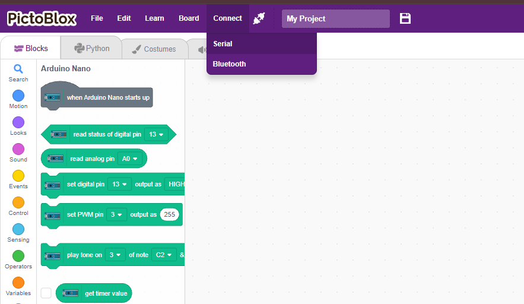

# Getting Started with the microcontroller (Arduino Nano-Compatible)

  

## 1. Introduction

The Sprout Maker Box's controller is an Arduino Nano-compatible board (ATmega328P, CH340 USB chip). It has a small onboard LED built right onto the board, connected to digital pin 13. This is the easiest way to check that the board works and that PictoBlox can talk to it.

  

---

## 2. Objectives

By the end of this guide, readers will be able to:

1.Install PictoBlox

2.Connect the microcontroller to a computer with a USB cable

3.Build a simple block code that turns on the onboard LED

---

## 3. Platform Choices

This board is an Arduino Nano-compatible controller, so this guide uses the Arduino platform in PictoBlox.

| Platform | Status |
|---------:|:------|
| Arduino | Used in this guide — board = Arduino Nano |
| ESP32 / micro:bit / RPi Pico | Not applicable — not included in the Sprout Maker Box |

---

## 4. Setup - Wiring Diagram and Step by Step

### What you need

- Sprout base board with Arduino Nano
- USB cable
- Computer

### Step-by-step setup

1. Install PictoBlox: go to thestempedia.com/pictoblox-desktop and download the version for your computer (Windows/macOS), then install it.
2. Connect the microcontroller: plug the USB cable into the Arduino Nano board and the other end into your computer.

  

3. Open PictoBlox, go to the Boards tab, and select "Arduino Nano."

  

4. Select the COM port for your board and click Connect.

  

  

## 5. Coding - PictoBlox

PictoBlox is a block-based coding platform that is easy for beginners to understand.

Steps to build the block code:

1. Go to the Blocks workspace.
2. From the Pins category, drag out a "digital write pin (13) value (HIGH)" block into the workspace.
3. Click the block (or the green flag) to run it and upload it to the board.

### What this program does
- The LED turns on
- It waits for one second
- It turns off
- It repeats again and again
---

## 6. Simulation

Simulation means testing your project on the screen before using real hardware.

## 7. Results

Expected outcome:

The onboard LED next to pin 13 on the board turns on and stays on.
[ Insert photo of the onboard LED lit up on the real board ]

Troubleshooting:

Board not showing in PictoBlox → check the USB cable is connected and try a different COM port.
LED doesn't turn on → make sure the block ran without errors and pin 13 was used.

## 8. Conclusion

You have now learned the basics of using an Arduino Nano-compatible microcontroller. You know what it is, how it can be connected, and how simple programs can make it do useful things.

The most important lessons are:
- start small
- connect wires carefully
- test your code step by step
- have fun while learning

With practice, you can build lights, sensors, robots, and many more exciting projects.