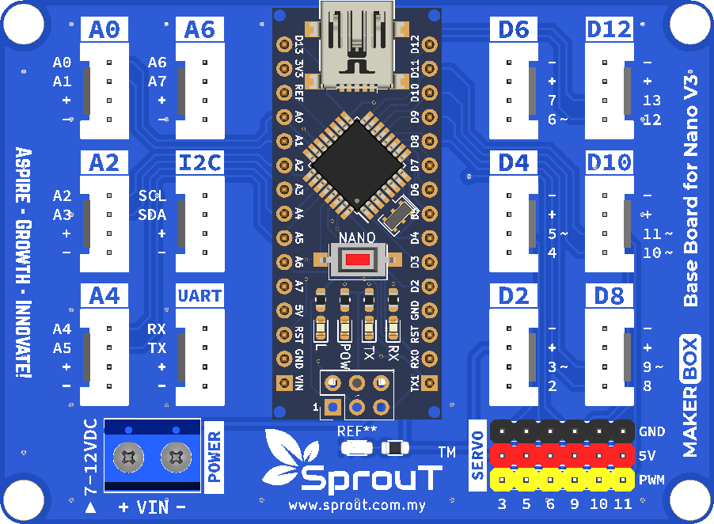
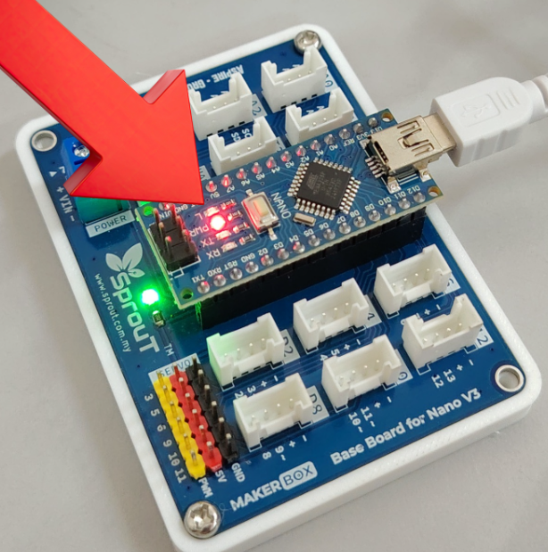
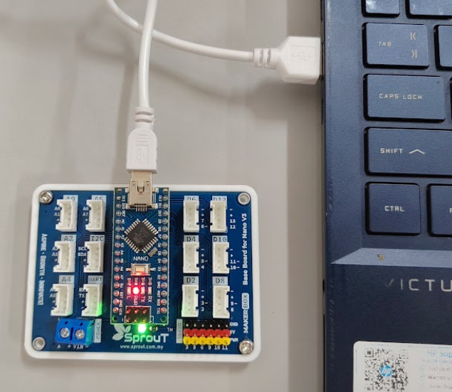
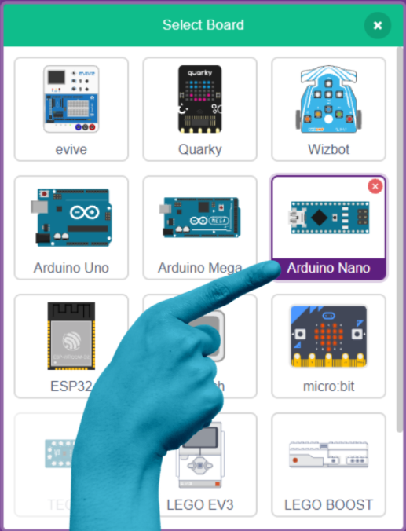
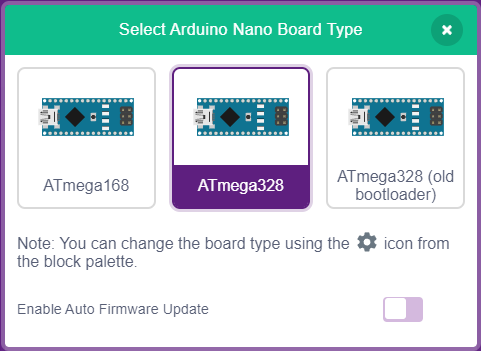
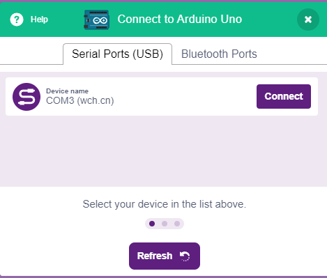
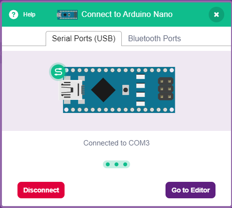
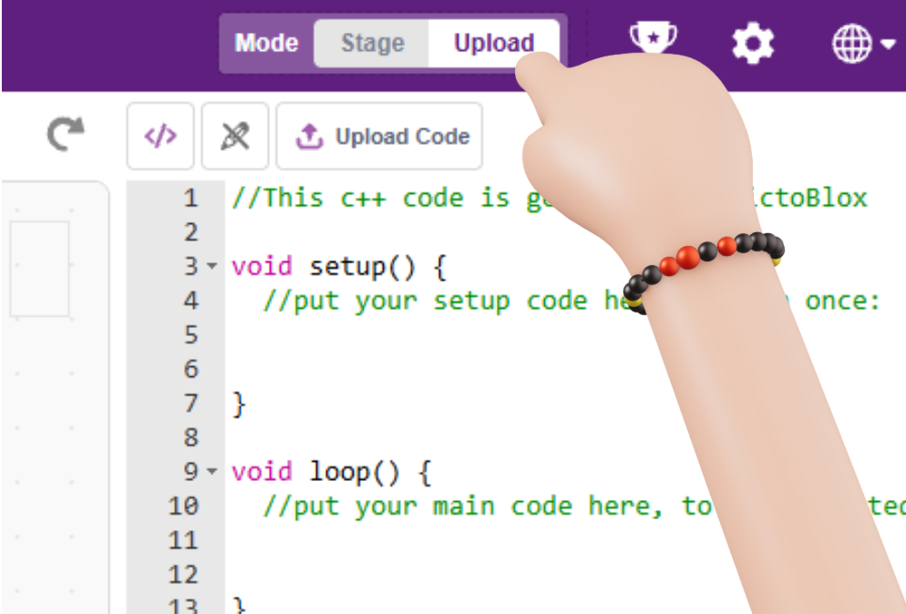
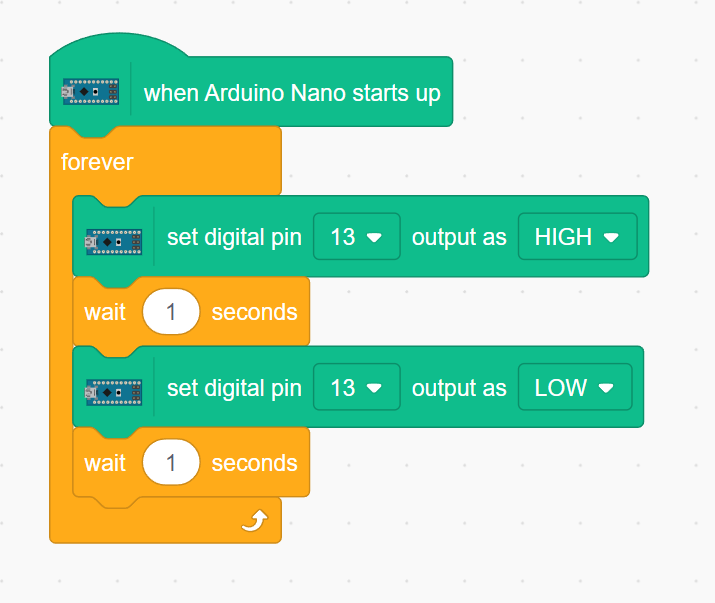
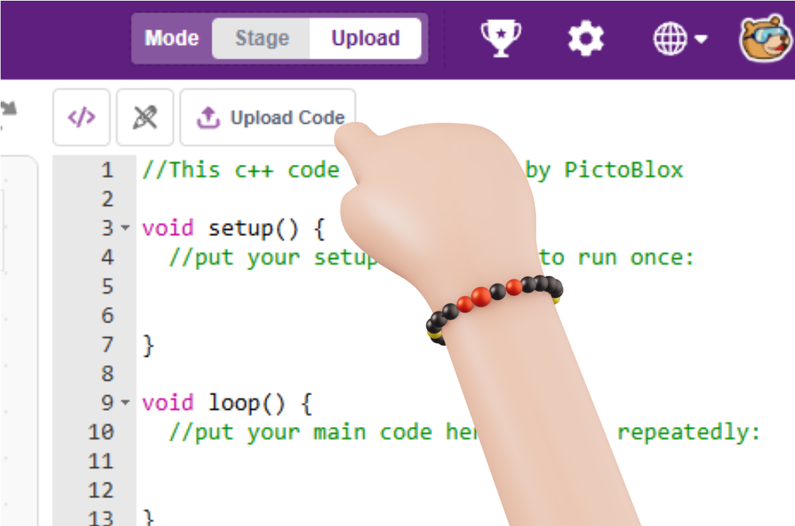

# Getting Started with the microcontroller (Arduino Nano-Compatible)

  

## Introduction

The Sprout Maker Box's controller is an Arduino Nano-compatible board (ATmega328P, CH340 USB chip). It has a small onboard LED built right onto the board, connected to digital pin 13. This is the easiest way to check that the board works and that PictoBlox can talk to it.

  

---

## Objectives

By the end of this guide, readers will be able to:

1. Install PictoBlox

2. Connect the microcontroller to a computer with a USB cable

3. Build a simple block code that turns on the onboard LED

---

## Platform Choices

This board is an Arduino Nano-compatible controller, so this guide uses the Arduino platform in PictoBlox.

| Platform | Status |
|---------:|:------|
| Arduino | Used in this guide — board = Arduino Nano |
| ESP32 / micro:bit / RPi Pico | Not applicable — not included in the Sprout Maker Box |

---

## Setup

### What you need

- Sprout base board with Arduino Nano
- USB cable
- Computer

### Step-by-step guide

1. Install PictoBlox: go to [thestempedia.com/pictoblox-desktop](https://thestempedia.com/product/pictoblox/download-pictoblox/) and download the version for your computer (Windows/macOS), then install it.
2. Connect the microcontroller: plug the USB cable into the Arduino Nano board and the other end into your computer.

  

3. Open PictoBlox, go to the Boards tab, and select "Arduino Nano."

  

4. Select "ATmega328".

  

5. Select the COM port for your board and click Connect.

  

6. This message will appear when the board is connected.

  

7. On the top-right corner, click "Upload".

  

## 5. Coding - PictoBlox

PictoBlox is a block-based coding platform that is easy for beginners to understand.

Steps to build the block code:

1. Start the script: Drag a green "when Arduino Nano starts up" block into the workspace.

2. Add a loop: Snap a gold forever loop underneath it.

3. Turn it ON: Inside the loop, snap a blue digital write pin (13) value (HIGH) block, followed by a gold wait (1) seconds block.

4. Turn it OFF: Right below that, snap another blue digital write pin (13) value (LOW) block, followed by another gold wait (1) seconds block.

It should look like this:

  

5. Upload to Arduino: Click the "Upload Code" on the top-right corner to upload and start the blinking.

  

  

Troubleshooting:

Board not showing in PictoBlox → check the USB cable is connected and try a different COM port.
LED doesn't turn on → make sure the block ran without errors and pin 13 was used.

## Conclusion

You have now learned the basics of using an Arduino Nano-compatible microcontroller. You know what it is, how it can be connected, and how simple programs can make it do useful things.

With practice, you can build lights, sensors, robots, and many more exciting projects.